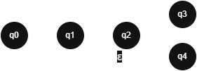
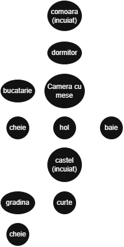

# Limbaje Formale și Automate (An 1 Sem. 2)

Pentru rularea acestor scripturi nu trebuie să instalezi librării suplimentare, folosesc doar librăriile standard Python.

Fișierele atașate sunt rezultatul următoarelor teme:

---

## 1. DFA și NFA

**Script:** [machine.py](machine.py)  
**Input:** [machine.bd](machine.bd)

Ambele tipuri de automate sunt abordate în același fișier.

### Reprezentare grafică


### Rulare
```bash
python3 machine.py machine.bd
```

---

## 2. Joc în DFA/NFA

**Script:** [secvential_input.py](secvential_input.py)  
**Input:** [castle_game.bd](castle_game.bd)

Pentru joc am creat un script separat care acceptă inputul *symbol cu symbol* pentru a fi mai distractiv.

### Acțiuni posibile
- `n` - mergi în nord
- `e` - mergi în est  
- `s` - mergi în sud
- `w` - mergi în vest
- `p` - ridică cheie (pick up)

### Reprezentare grafică


**Notă:** Reprezentarea de mai sus este o formă simplificată a diagramei adevărate întrucât fiecare cameră are o formă **cu** și **fără** cheie pentru a simula camerele încuiate.

### Rulare
```bash
python3 secvential_input.py castle_game.bd
```

---

## 3. PDA (Pushdown Automaton)

**Script:** [pda.py](pda.py)  
**Input:** [pda.bd](pda.bd)

Acest PDA verifică dacă inputul este de forma:
```
{ a^n b^m | n>0, m>0, n>m }
```

### Rulare
```bash
python3 pda.py pda.bd
```

---

## 4. Mașina Turing

**Script:** [turing.py](turing.py)  
**Input:** [turing.bd](turing.bd)

Această mașină Turing verifică dacă inputul este de forma:
```
{ 0^n 1^n | n>0 }
```

### Rulare
```bash
python3 turing.py turing.bd
```
